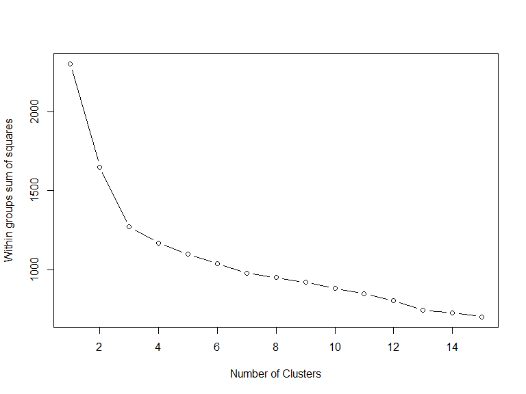
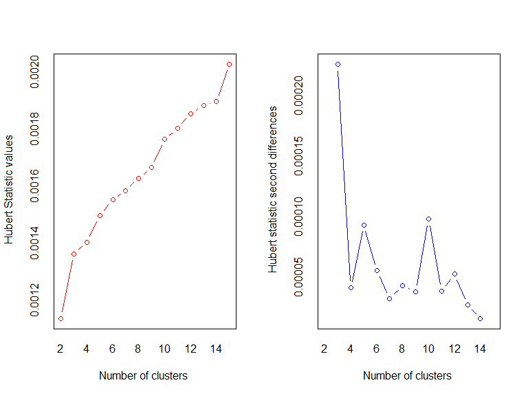
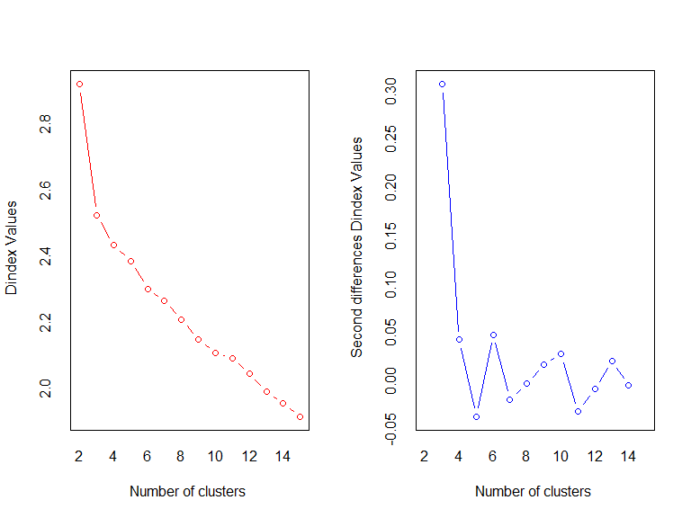

    head(wine)

    ##   Type Alcohol Malic  Ash Alcalinity Magnesium Phenols Flavanoids
    ## 1    1   14.23  1.71 2.43       15.6       127    2.80       3.06
    ## 2    1   13.20  1.78 2.14       11.2       100    2.65       2.76
    ## 3    1   13.16  2.36 2.67       18.6       101    2.80       3.24
    ## 4    1   14.37  1.95 2.50       16.8       113    3.85       3.49
    ## 5    1   13.24  2.59 2.87       21.0       118    2.80       2.69
    ## 6    1   14.20  1.76 2.45       15.2       112    3.27       3.39
    ##   Nonflavanoids Proanthocyanins Color  Hue Dilution Proline
    ## 1          0.28            2.29  5.64 1.04     3.92    1065
    ## 2          0.26            1.28  4.38 1.05     3.40    1050
    ## 3          0.30            2.81  5.68 1.03     3.17    1185
    ## 4          0.24            2.18  7.80 0.86     3.45    1480
    ## 5          0.39            1.82  4.32 1.04     2.93     735
    ## 6          0.34            1.97  6.75 1.05     2.85    1450

Exercise 1: Remove the first column from the data and scale it using the
scale() function

    df <- scale(wine[, -1])

We will try two methods to find out how many clusters to use.

Method 1:A plot of the total within-groups sums of squares against
thenumber of clusters in a K-means solution can be helpful. A bend in
the graph can suggest the appropriate number of clusters.

    wssplot <- function(data, nc=15, seed=1234){
                      wss <- (nrow(data)-1)*sum(apply(data,2,var))
                          for (i in 2:nc){
                    set.seed(seed)
                        wss[i] <- sum(kmeans(data, centers=i)$withinss)}
                        
                  plot(1:nc, wss, type="b", xlab="Number of Clusters",
                                ylab="Within groups sum of squares")
           }

Exercise 2: - How many clusters does this method suggest? - Why does
this method work? What's the intuition behind it? - Look at the code for
wssplot() and figure out how it works

This method clearly suggests 3 clusters.

    ## *** : The Hubert index is a graphical method of determining the number of clusters.
    ##                 In the plot of Hubert index, we seek a significant knee that corresponds to a 
    ##                 significant increase of the value of the measure i.e the significant peak in Hubert
    ##                 index second differences plot. 
    ## 

    ## *** : The D index is a graphical method of determining the number of clusters. 
    ##                 In the plot of D index, we seek a significant knee (the significant peak in Dindex
    ##                 second differences plot) that corresponds to a significant increase of the value of
    ##                 the measure. 
    ##  
    ## ******************************************************************* 
    ## * Among all indices:                                                
    ## * 4 proposed 2 as the best number of clusters 
    ## * 15 proposed 3 as the best number of clusters 
    ## * 1 proposed 10 as the best number of clusters 
    ## * 1 proposed 12 as the best number of clusters 
    ## * 1 proposed 14 as the best number of clusters 
    ## * 1 proposed 15 as the best number of clusters 
    ## 
    ##                    ***** Conclusion *****                            
    ##  
    ## * According to the majority rule, the best number of clusters is  3 
    ##  
    ##  
    ## *******************************************************************

Exercise 3: How many clusters does this method suggest?

This method suggests 3 clusters

Exercise 4: Once you've picked the number of clusters, run k-means using
this number of clusters. Output the result of calling kmeans() into a
variable fit.km

    fit.km <- kmeans(df, centers = 3 )

Now we want to evaluate how well this clustering does.

Exercise 5: using the table() function, show how the clusters in
fit.km\\*c**l**u**s**t**e**r**s**c**o**m**p**a**r**e**s**t**o**t**h**e**a**c**t**u**a**l**w**i**n**e**t**y**p**e**s**i**n**w**i**n**e*Type.
Would you consider this a good clustering?

    table(fit.km$cluster, wine$Type)

    ##    
    ##      1  2  3
    ##   1  0  3 48
    ##   2  0 65  0
    ##   3 59  3  0

Exercise 6: - Visualize these clusters using function clusplot() from
the cluster library - Would you consider this a good clustering?

